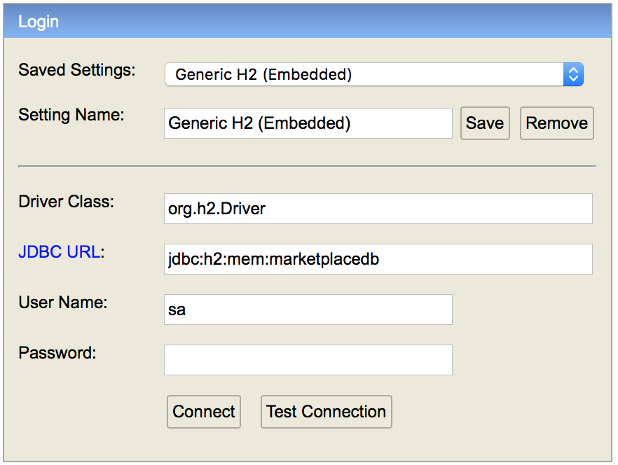

# README #

# Marketplace #
This is a Marketplace REST API for Self Employed "Buyers" where they can Bid to work on Projects posted by Employers "Sellers".

# Getting Started #

Framework: 	Spring Boot.
Database: 	H2 in memory database.
IDE: 		IntelliJ.

Please run the app using "MarketplaceApplication".

Running the app automatically inserts a Buyer and a Seller into the DB using the DataLoader.

Once the application is up and running, the H2 Console can be viewed using the following link:
http://localhost:8080/h2-console

Please use the following parameters to login on the H2 Console:

Driver Class: 	org.h2.Driver
JDBC URL:		jdbc:h2:mem:marketplacedb
Username:		sa
Password:		{leave it blank}

# Here are the supported actions / endpoints #

	1. Create Project (POST):
		
		URL: http://localhost:8080/marketplace/project
		
		Parameters:		
		
						{
    						"sellerId": 1,
    						"project": {
    							"id": 1,
    							"description": "Sample Project",
    							"auctionStartDate": "2018-01-21T16:00:00",
    							"auctionEndDate": "2018-01-23T16:00:00",
    							"maxBudget": 123
    						}
						}
		
		Success Response: 
		
						{
    						"id": 1,
						    "description": "Sample Project",
						    "auctionStartDate": "2018-01-21",
						    "auctionEndDate": "2018-01-23",
						    "maxBudget": 123,
						    "minBidIndex": null,
						    "buyerWithMinBid": null,
						    "seller": {
						        "id": 1,
						        "firstName": "Dan",
						        "lastName": "Doe",
						        "organization": "Intuit",
						        "email": "dan@mail.com"
						    },
						    "lowestBid": 0
						}
						
		Failure Response: 
		
			The service throws a 401 Unauthorized when the Seller Id is not valid.
			

	2. Get Project by Id (GET):
		
		URL: http://localhost:8080/marketplace/project?projectId=1
		
		Parameters:	This endpoint needs a query parameter "projectId".
		
		Success Response:

						{
						    "id": 1,
						    "description": "Sample Project",
						    "auctionStartDate": "2018-01-21",
						    "auctionEndDate": "2018-01-23",
						    "maxBudget": 123,
						    "minBidIndex": null,
						    "buyerWithMinBid": null,
						    "seller": {
						        "id": 1,
						        "firstName": "Dan",
						        "lastName": "Doe",
						        "organization": "Intuit",
						        "email": "dan@mail.com"
						    },
						    "lowestBid": 0
						}
						
		Failure Response:
			
			In case of invalid projectId, the service returna a EntityNotFoundException.

						{
    						"timestamp": 1516588403065,
						    "status": 500,
						    "error": "Internal Server Error",
						    "exception": "javax.persistence.EntityNotFoundException",
						    "message": "Project Not Found",
						    "path": "/marketplace/project"
						}
						
	3. Place Bid (POST):
	
		URL: http://localhost:8080/marketplace/bid
		
		Parameters:
		 
						{
							"buyerId": 1,
							"projectId": 1,
							"amount": 100
						}

		Success Response:

						{
						    "id": 1,
						    "description": "Sample Project",
						    "auctionStartDate": "2018-01-21",
        					"auctionEndDate": "2018-01-23",
						    "maxBudget": 123,
						    "minBidIndex": 0,
						    "buyer": {
						        "id": 1,
						        "firstName": "John",
						        "lastName": "Doe",
						        "email": "john@mail.com"
						    },
						    "seller": {
						        "id": 1,
						        "firstName": "Dan",
						        "lastName": "Doe",
						        "organization": "Intuit",
						        "email": "dan@mail.com"
						    },
						    "lowestBid": 100
						}
						
		Failure Response:

			In case of invalid BuyerId, the service returns a 401 Unauthorized.

			When the ProjectId is invalid, the service returns a EntityNotFoundException:
						{
						    "timestamp": 1516588403065,
						    "status": 500,
						    "error": "Internal Server Error",
						    "exception": "javax.persistence.EntityNotFoundException",
						    "message": "Project Not Found",
						    "path": "/marketplace/bid"
						}
						
	4. Get All Open Projects (GET):
	
		URL: http://localhost:8080/marketplace/projects
		
		Parameters: None
		
		Success Response: The service returns a list of all open projects.
		
						[
						    {
						        "id": 1,
						        "description": "Sample Project",
						        "auctionStartDate": "2018-01-21",
        						"auctionEndDate": "2018-01-23",
						        "maxBudget": 123,
						        "minBidIndex": null,
						        "buyer": null,
						        "seller": {
						            "id": 1,
						            "firstName": "Dan",
						            "lastName": "Doe",
						            "organization": "Intuit",
						            "email": "dan@mail.com"
						        },
						        "lowestBid": 0
						    }
						]
						
		Failure Response: 
		
			The service returns an empty list.
			
	5. Get Auction Status (GET): 

		URL: http://localhost:8080/marketplace/status?projectId=1

		Parameters: This endpoint needs a query parameter "projectId".

		Success Response:

			In case the projectId is invalid: 						
				The service returns a EntityNotFoundException.
			
			If the request falls within the Auction Time:  			
				200 OK "Auction is still Active"
			
			If the request falls before the Auction Start Time: 	
				200 OK "Auction is Not Active"

			If the request falls after the Auction End Time: 		
				The service returns a 200 OK along with information about who won the auction along with the bid amount.
				E.g. : "Buyer John won the auction for a Bid of 100.00"

# Future Enhancements #

I was not able to devote as much time as I wanted to the assignment.
Here are some enhancements that I would have done if I would have put more time on it.

1. Add ability to cancel a Bid.
	Currently the service only allows us to place a bid on a project. In a real scenario however, cancelling a Bid is also good to have.

2. Implement automated approach to decide Auction winner:
	As of now the winner is found out by calling the /status endpoint which determines (on each call) whether the request is issued before, during or after the auction.
	An ideal approach to this would have been to implement a Timer, or better use an Observable to notify the user who has won the auction.
	Also, In case there are no Bids during the Auction, the end time of the Auction should be extended by a pre defined duration.

3. Better Response Messages.

# Questions from the Assignment #

1. The time the exercise took (after dev environment is set up):
Ans: Approximately 5 hours

2. Exercise Difficulty
Ans: Moderate

3. How did you feel about the exercise itself? (1 lowest, 10 highest—awesome way to assess coding ability)
Ans: 10 - I feel that a coding challenge is the best way to test a developer's skills.

4. How do you feel about coding an exercise as a step in the interview process?  (1 lowest, 10 highest—awesome way to assess coding ability)
Ans: 10

5. What would you change in the exercise and/or process?
Ans: Nothing comes in mind.